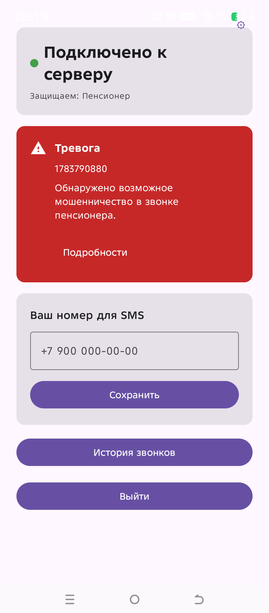

# Family Shield — защита пенсионеров от телефонных мошенников

Android-приложение и backend, которые **в реальном времени** слушают телефонный
звонок пенсионера, распознают мошенническую схему и:

1. **предупреждают пенсионера голосом прямо в разговор** (TTS в динамик);
2. **уведомляют родственника** (full-screen push + SMS) со ссылкой на транскрипт.

Плательщик и настройщик — **родственник**. Под защитой — **пенсионер (senior)**.

---

## Как это работает

```
   ┌─────────────────────────┐       WS /ws/call          ┌────────────────────────┐
   │  ПЕНСИОНЕР (Android)     │  ─── audio chunks ~8s ──▶ │  BACKEND (FastAPI)      │
   │                          │                            │                         │
   │  AccessibilityService    │                            │  PII-filter (regex)     │
   │   └─ клик на "Динамик"   │                            │  ASR:                   │
   │  ForegroundService "Щит" │                            │   1) OpenRouter Whisper │
   │   └─ AudioRecord 16 kHz  │                            │   2) SaluteSpeech       │
   │  TtsPlayer               │  ◀── {action:"tts",...}   │   3) Neuro.net          │
   │   └─ проигрывает alert   │                            │  LLM classify           │
   └─────────────────────────┘                            │   (gpt-4o-mini,          │
                                                          │    DeepSeek fallback)    │
                                                          │  verdict + threat level │
                                                          └──────────┬──────────────┘
                                                                     │  scam?
                                                                     ▼
                                                          ┌────────────────────────┐
                                                          │ FCM push + WS /ws/notify│
                                                          │ + SMS (SMSAERO.ru)       │
                                                          └──────────┬──────────────┘
                                                                     ▼
                                                          ┌────────────────────────┐
                                                          │  РОДСТВЕННИК (Android)  │
                                                          │  Full-screen alert      │
                                                          │  История + транскрипт   │
                                                          └────────────────────────┘
```

Сервер — «мозг» (ASR + LLM + оповещения). Телефон пенсионера — только микрофон,
динамик и TTS-колонка. Аудио **не сохраняется**, только текст транскрипта
(30 дней, ФЗ-152).

---

## Скриншоты

| Кабинет родственника | Уведомление о тревоге |
|---|---|
|  |  |

---

## Стек

### Backend
- **Python 3.11**, **FastAPI 0.115**
- **SQLAlchemy 2.0 + SQLite** (файл `family_shield.db`)
- **httpx** (async) для всех внешних API
- WebSocket — встроенный в FastAPI (`/ws/call`, `/ws/notify`)
- Простой HMAC-токен вместо полного JWT
- Деплой: uvicorn под systemd + Caddy (auto-HTTPS)

### Android
- **Kotlin + Jetpack Compose (Material 3)**
- `compileSdk 35`, `minSdk 28` (Android 9)
- **Retrofit 2** (REST) + **OkHttp WebSocket** (audio-стрим и notify)
- **AudioRecord** — сырой PCM 16 kHz mono
- **AccessibilityService** (детект звонка + клик по кнопке спикерфона) + **Foreground Service**
- Системный **TextToSpeech** для предупреждения
- **Firebase Cloud Messaging** — push родственнику
- **DataStore Preferences** — сессия и настройки сервера

### Внешние сервисы

| Сервис | Роль |
|---|---|
| **OpenRouter STT** (Whisper-large-v3) | ASR основной |
| SaluteSpeech (Сбер) | ASR fallback #1 |
| Neuro.net | ASR fallback #2 |
| **OpenRouter LLM** (gpt-4o-mini, DeepSeek fallback) | Классификация мошенничества |
| **SMSAERO.ru** | Экстренное SMS родственнику |
| **Firebase Cloud Messaging** | Push родственнику |
| ЮKassa | Подписка (запланировано) |

---

## Ключевой пользовательский сценарий

1. Пенсионеру звонит «служба безопасности банка».
2. `ShieldAccessibilityService` детектит `CallState.ACTIVE` и **кликом по кнопке
   дайлера** включает громкую связь (`AudioManager.setSpeakerphoneOn()` на
   Android 10+ игнорируется системой — работает только accessibility-клик).
3. `ForegroundService` пишет PCM 16 kHz с микрофона, режет на чанки ~8 сек и
   стримит на сервер по `WS /ws/call`.
4. Сервер: **PII-фильтр (regex) → OpenRouter Whisper (ASR) → gpt-4o-mini
   классификатор → вердикт** `safe / suspicious / scam` со score 0..100.
5. Если `verdict == "scam"` и `score >= 0.85`:
   - на телефон пенсионера через WS уходит команда
     `{"action":"tts", "text":"Внимание! Возможный мошенник. Не сообщайте данные карты."}` —
     TTS проигрывает её **прямо в разговор**;
   - родственнику **одновременно** отправляются **WS notify + FCM full-screen push + SMS**;
   - в БД пишется `Call` с транскриптом и `Alert` с каналами доставки.
6. Родственник тапает по алерту → открывается транскрипт и метаданные звонка.

---

## Быстрый старт

### Backend

```bash
# 1. Виртуальное окружение
python -m venv .venv
# Linux / macOS:
source .venv/bin/activate
# Windows:
.venv\Scripts\activate

# 2. Зависимости
pip install -r requirements.txt

# 3. Переменные окружения
cp .env.example .env   # Windows: copy .env.example .env
# и заполнить ключи — минимум OPENROUTER_API_KEY

# 4. Запуск
uvicorn app.main:app --reload
```

Проверка: <http://127.0.0.1:8000/api/health> должен вернуть `{"status":"ok"}`.
Swagger docs: <http://127.0.0.1:8000/docs>.

При первом старте создаётся `family_shield.db` со всеми таблицами (см. `app/models.py`).

### Android

1. Открыть папку `android/` в Android Studio (JDK 21, AGP 8.x).
2. Положить свой `google-services.json` в `android/app/`
   (Firebase Cloud Messaging обязателен для push родственнику).
3. В `android/local.properties` выставить дефолтный адрес сервера:
   ```
   wsBaseUrl=ws://192.168.0.12:8000
   ```
   Дефолт можно поменять и позже — адрес сервера **редактируется в runtime**
   через экран настроек (`⚙` на `RoleSelectScreen` и `RelativeHomeScreen`),
   пересборка APK не нужна.
4. Собрать APK и установить **физически** на телефон родственника и телефон
   пенсионера (Google Play такое приложение забанит — распространение только
   через APK).

---

## Переменные окружения (backend)

Все ключи читаются в `app/config.py`. Минимально работающий `.env`:

```env
APP_SECRET=change-me-in-production
DB_FILE=family_shield.db

# LLM классификатор + ASR через OpenRouter (один ключ на оба)
OPENROUTER_API_KEY=sk-or-...
OPENROUTER_MODEL=openai/gpt-4o-mini
OPENROUTER_STT_MODEL=openai/whisper-large-v3
SCAM_SCORE_THRESHOLD=0.85

# ASR fallback #1 (опционально)
SALUTE_SPEECH_API_KEY=

# ASR fallback #2 (опционально)
NEURO_NET_API_KEY=

# SMS родственнику
SMSAERO_EMAIL=
SMSAERO_API_KEY=
SMSAERO_SIGN=

# FCM v1 (service account JSON)
FCM_SERVICE_ACCOUNT_PATH=./secrets/fcm-service-account.json

# Формат аудио
PCM_SAMPLE_RATE=16000
PCM_CHUNK_DURATION_SEC=8
```

---

## API

### REST

| Метод | Путь | Что делает |
|---|---|---|
| `POST` | `/api/senior/register` | Регистрация пенсионера → `pairing_code + token` |
| `POST` | `/api/relative/register` | Регистрация родственника → `token` |
| `POST` | `/api/family/pair` | Родственник вводит `pairing_code` |
| `POST` | `/api/relative/phone` | Сохранить номер для SMS |
| `POST` | `/api/relative/fcm-token` | Сохранить FCM-токен для push |
| `GET`  | `/api/me` | Профиль + активные family_links |
| `GET`  | `/api/calls/history` | История звонков (для relative) |
| `GET`  | `/api/calls/{id}` | Детали + транскрипт |
| `POST` | `/api/debug/analyze` | Debug: прогнать транскрипт через классификатор |
| `GET`  | `/api/health` | Проверка живости |

### WebSocket

| Путь | Роль | Направление |
|---|---|---|
| `WS /ws/call?token=...` | senior | клиент → сервер: PCM-чанки; сервер → клиент: `{action:"tts",text:...}` |
| `WS /ws/notify?token=...` | relative | сервер → клиент: real-time alerts (дублируется FCM-пушем) |

---

## Структура репозитория

```
family-shield/
├── app/                    # FastAPI backend
│   ├── main.py             # роуты REST + WS
│   ├── asr.py              # цепочка OpenRouter → SaluteSpeech → Neuro.net
│   ├── classifier.py       # LLM-классификатор мошенничества
│   ├── pii.py              # regex-фильтр PII
│   ├── pipeline.py         # склейка ASR → PII → LLM
│   ├── alerting.py         # рассылка тревоги (WS + FCM + SMS)
│   ├── fcm.py              # Firebase Cloud Messaging v1
│   ├── sms.py              # SMSAERO.ru
│   ├── auth.py             # HMAC-токены
│   ├── models.py           # SQLAlchemy-модели
│   ├── schemas.py          # Pydantic-схемы REST API
│   └── database.py         # engine + session factory
├── android/                # Android-клиент (Kotlin + Compose)
│   └── app/src/main/java/ru/familyshield/app/
│       ├── ui/screens/     # AlertScreen, RelativeHomeScreen, ...
│       ├── ui/viewmodel/
│       ├── service/        # NotifyService, ShieldAccessibilityService, FCM
│       ├── network/        # Retrofit + OkHttp WebSocket
│       ├── data/           # SessionStore, ServerConfigStore (DataStore)
│       └── di/             # AppContainer (ручной DI)
├── tests/                  # pytest
├── scripts/                # вспомогательные скрипты
├── requirements.txt
├── PROJECT.md              # инженерная документация MVP (детали архитектуры)
└── README.md               # этот файл
```

**Детальная документация** — см. [`PROJECT.md`](./PROJECT.md): архитектура,
критическое предупреждение по захвату звука на Android 10+, серверный пайплайн,
план разработки, юридический минимум.

---

## Как разрабатывалось

MVP собран одним человеком через **Kodik** с моделями **GPT-5.4** и
**GPT-5.4 mini** в формате «одна задача X.Y → план → код → как проверить →
git commit», ~10 недель работы. Все крупные архитектурные решения зафиксированы
в `PROJECT.md`.

---

## Юридический дисклеймер

Приложение записывает и анализирует телефонный разговор — это затрагивает
**вторую сторону линии**. Перед публичным запуском обязательно:

- явный экран согласия у **обеих ролей** (senior и relative);
- показать политику обработки данных юристу;
- аудио **не хранится**, транскрипт — не более 30 дней (152-ФЗ);
- для теста «на своих» семьях — только с их прямого согласия.

Дистрибуция — только через APK. Google Play такое приложение забанит (запись
телефонных звонков).

---

## Статус

MVP на стадии подготовки к демо. Реализовано:

- ✅ backend: WS `/ws/call`, `/ws/notify`, REST регистрации/паринга/истории
- ✅ ASR-цепочка (OpenRouter Whisper + fallback)
- ✅ LLM-классификатор + PII-фильтр
- ✅ рассылка тревоги (WS + FCM + SMS)
- ✅ Android: два UI (senior / relative), Compose, Retrofit, WS
- ✅ AccessibilityService + ForegroundService для senior
- ✅ full-screen FCM alert для relative
- ✅ WS reconnect с backoff + сетевой callback
- ✅ runtime-настройки адреса сервера
- ⏳ ЮKassa-подписка (запланировано после хакатона)
